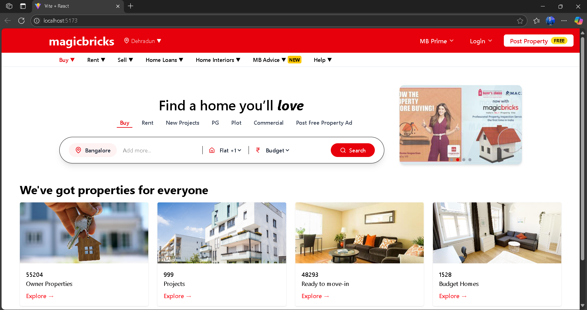

# 🏠 GharPadharo Intern Task – MagicBricks UI (Frontend Development)

A clean, modern **real estate landing page UI**, inspired by **MagicBricks**. This project focuses on building a user-friendly interface for property listings with an intuitive search experience.

Built using **React + Tailwind CSS + Lucide Icons**, this UI project is part of an internship task to showcase front-end development skills.

---

## 📸 Screenshots



---

## 🚀 Features

- 🔍 Property search bar with filters (location, flat type, budget)
- 🏘️ Tabs for property categories like Buy, Rent, PG, Plot, etc.
- 🎯 Clean code using React & Tailwind CSS

---

## 🛠️ Tech Stack

- **React JS**  
- **Tailwind CSS**  
- **Vite**  
- **Lucide-react** (icon library)  
- **React Router DOM**  

---

## 🧑‍💻 How to Run Locally

Make sure you have **Node.js** and **npm** installed.

### 1. Clone the repository

```bash
git clone https://github.com/Dipanshu-sandhaki/MagicBricks-UI.git
cd MagicBricks-UI/magic-bricks-landingpage
2. Install dependencies
npm install
3. Start the development server
npm run dev
Then, open http://localhost:5173 in your browser to see it live.

🙋‍♂️ Author
Dipanshu Sandhaki
💼 MCA Student | Web Developer | 

🔗 [LinkedIn Profile](https://www.linkedin.com/in/dipanshu-sandhaki) 
📫 Email: dipanshuroy6@gmail.com
